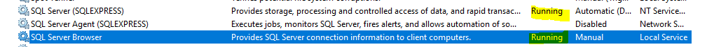
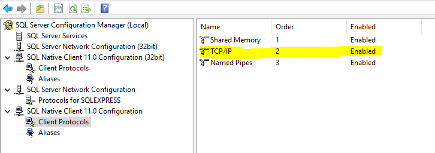
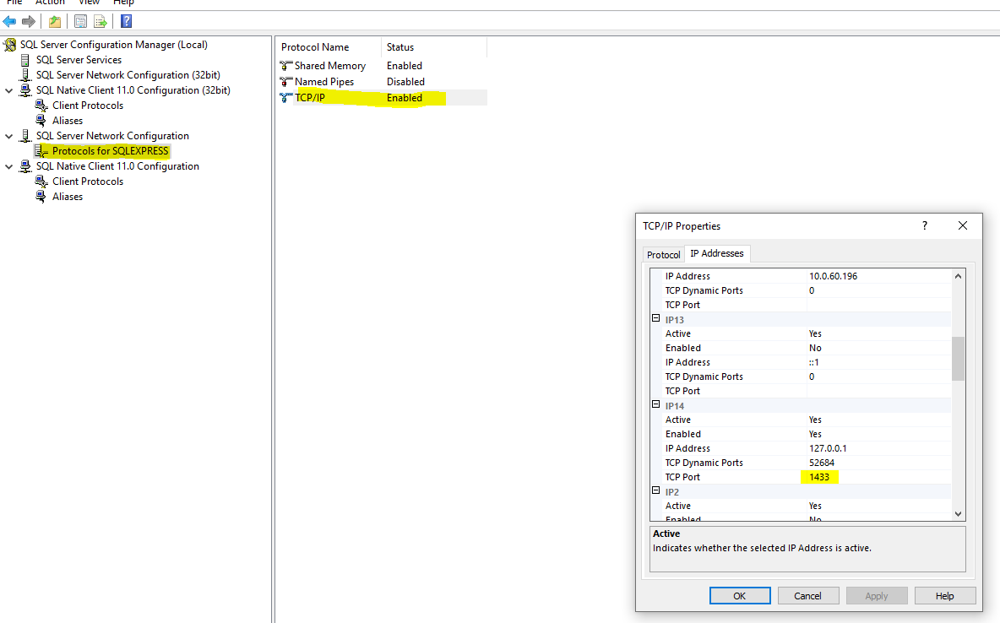

# Examples for connecting to local sql express db

One example using tedious
Another example using mssql

## Prequisites

Note I had to start the  SQL Server Browser service 

Note I had to enable the TCP connectivity 

Note I had to set the port used on the localhost interface 

And to get to the Sql Server Configuration Manager I had to drop into powershell and run  `SQLServerManager14.msc`

I also reset my local password using procedure described [here](http://duhjones.com/how-to-reset-lost-sa-password-in-sql-express/)

